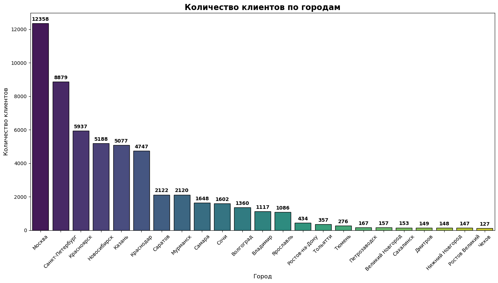
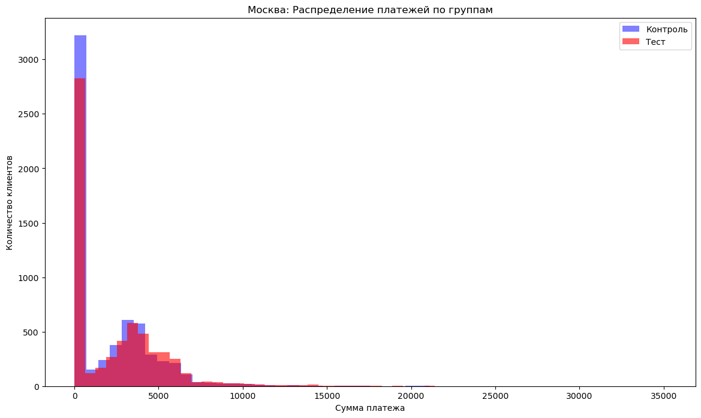
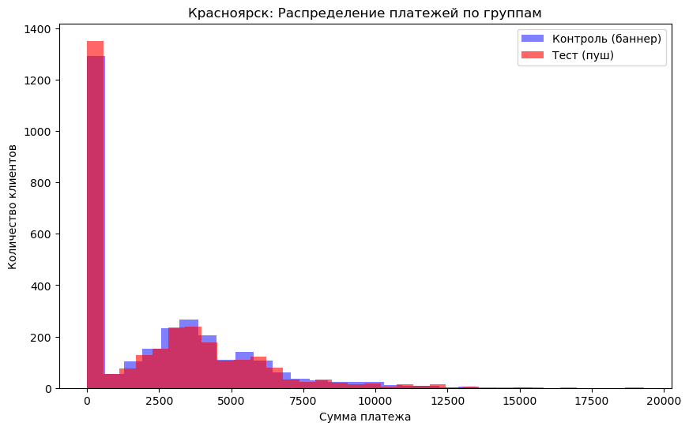
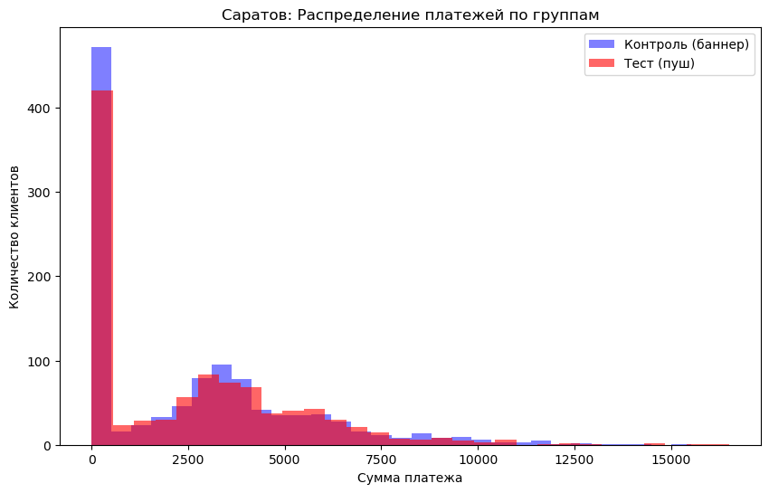
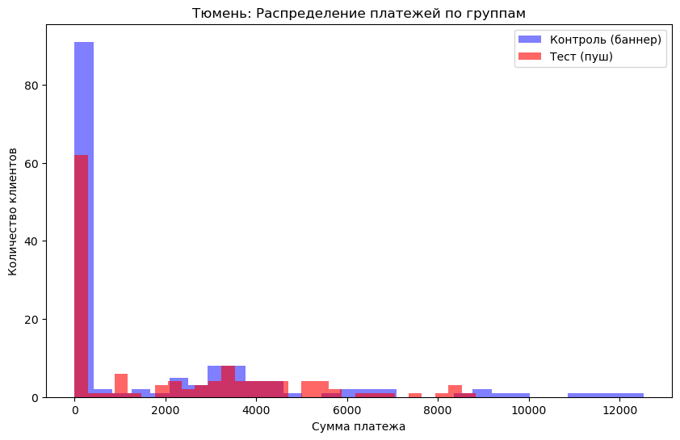
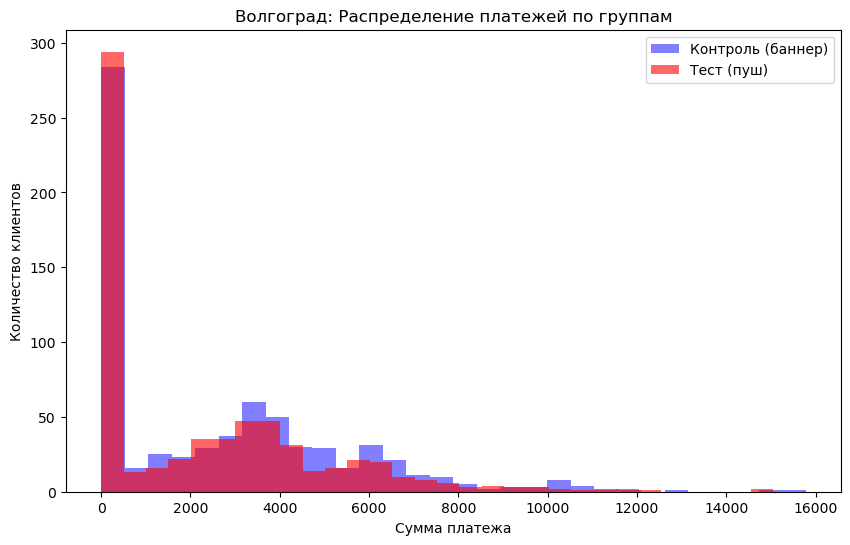
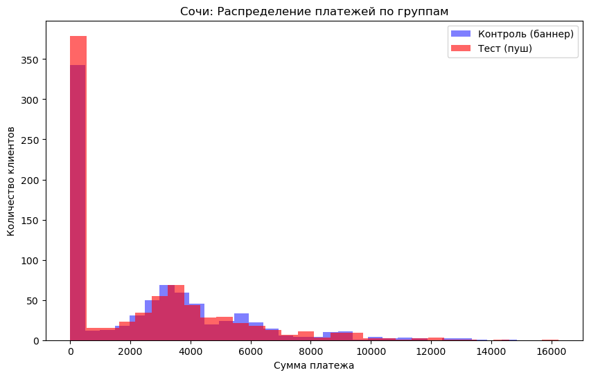
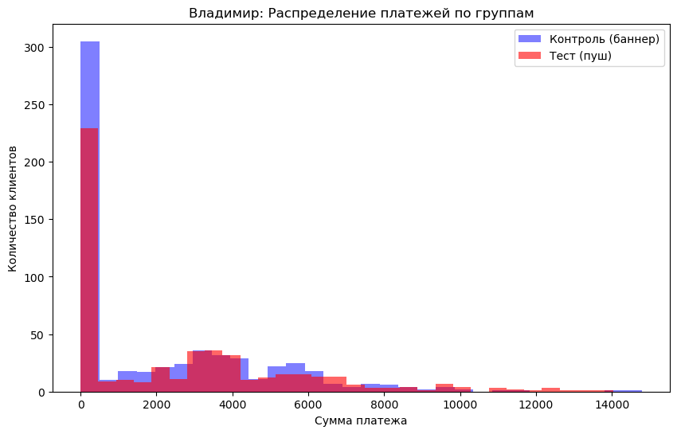
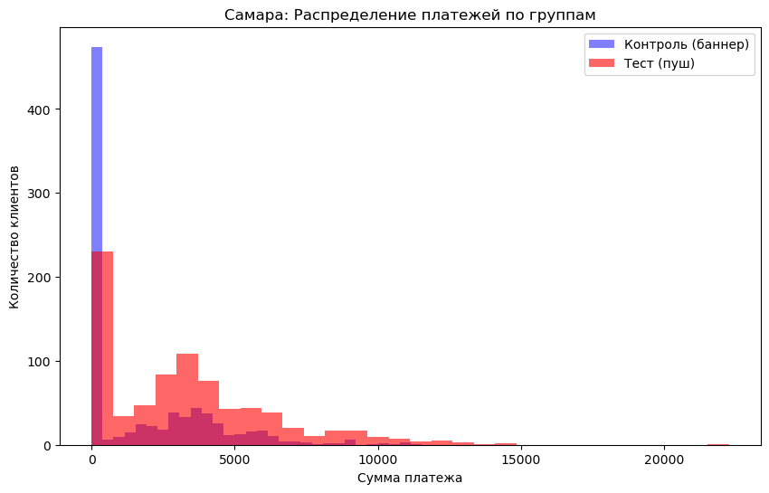
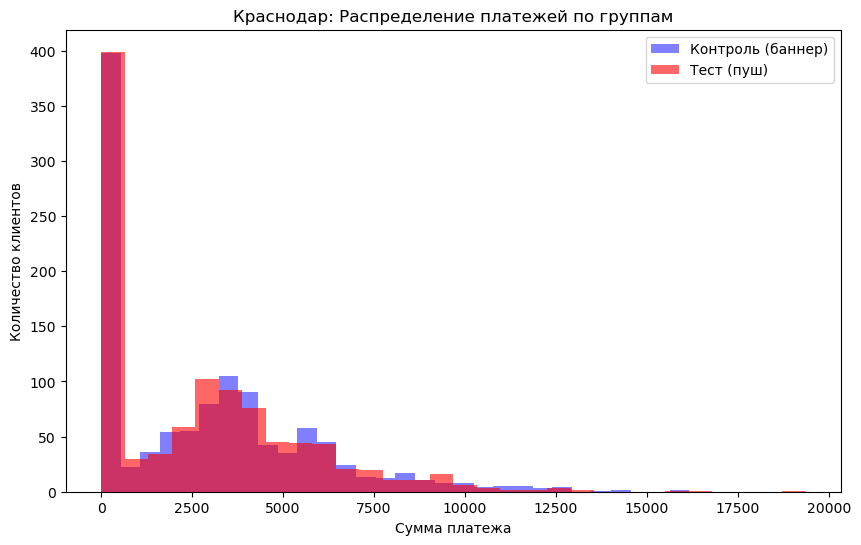

```python
import pandas as pd
import scipy.stats as st
import numpy as np
import matplotlib.pyplot as plt
import seaborn as sns
```

Импортируем и исследуем наши данные:


```python
df_data = pd.read_excel('Новый диплом датасет (1).xlsx')
df_data.info()
print()
print('Пропуски')
print(df_data.isna().sum())
print()
print('Средний чек')
print(df_data['amt_payment'].mean())
print('')
print('Количество наблюдений')
print(df_data['id_client'].count())
```

    <class 'pandas.core.frame.DataFrame'>
    RangeIndex: 37989 entries, 0 to 37988
    Data columns (total 4 columns):
     #   Column       Non-Null Count  Dtype         
    ---  ------       --------------  -----         
     0   id_order     37989 non-null  int64         
     1   id_client    37401 non-null  float64       
     2   amt_payment  35845 non-null  float64       
     3   dtime_pay    35560 non-null  datetime64[ns]
    dtypes: datetime64[ns](1), float64(2), int64(1)
    memory usage: 1.2 MB
    
    Пропуски
    id_order          0
    id_client       588
    amt_payment    2144
    dtime_pay      2429
    dtype: int64
    
    Средний чек
    3542.5464639419724
    
    Количество наблюдений
    37401
    

Нам нужно решить что делать с пропусками в колонках id_client, amt_payment и dtime_pay. Варианты:\

Удаление:     Удалить строки с пропусками. Но мы потеряем более 2000 записей.\

Заполнение:     Например, пропуски в amt_payment можно заполнить медианным или средним значением, но это может исказить анализ.\
Пропуски в id_client и dtime_pay заполнить адекватно чаще всего невозможно.\

Удаляем пропуски.


```python
df_data = df_data.dropna()
df_data
```


<div>
<style scoped>
    .dataframe tbody tr th:only-of-type {
        vertical-align: middle;
    }

    .dataframe tbody tr th {
        vertical-align: top;
    }

    .dataframe thead th {
        text-align: right;
    }
</style>
<table border="1" class="dataframe">
  <thead>
    <tr style="text-align: right;">
      <th></th>
      <th>id_order</th>
      <th>id_client</th>
      <th>amt_payment</th>
      <th>dtime_pay</th>
    </tr>
  </thead>
  <tbody>
    <tr>
      <th>0</th>
      <td>100238</td>
      <td>194569.0</td>
      <td>5373.0</td>
      <td>2022-10-28 04:05:15.221</td>
    </tr>
    <tr>
      <th>1</th>
      <td>100242</td>
      <td>191056.0</td>
      <td>4151.0</td>
      <td>2022-08-01 02:42:54.992</td>
    </tr>
    <tr>
      <th>2</th>
      <td>100249</td>
      <td>200049.0</td>
      <td>5688.0</td>
      <td>2022-08-24 12:45:12.744</td>
    </tr>
    <tr>
      <th>3</th>
      <td>100258</td>
      <td>206161.0</td>
      <td>4330.0</td>
      <td>2022-12-09 15:13:26.437</td>
    </tr>
    <tr>
      <th>4</th>
      <td>100267</td>
      <td>190945.0</td>
      <td>5488.0</td>
      <td>2022-08-03 02:07:31.468</td>
    </tr>
    <tr>
      <th>...</th>
      <td>...</td>
      <td>...</td>
      <td>...</td>
      <td>...</td>
    </tr>
    <tr>
      <th>37983</th>
      <td>297572</td>
      <td>195257.0</td>
      <td>2191.0</td>
      <td>2022-08-21 18:31:51.585</td>
    </tr>
    <tr>
      <th>37985</th>
      <td>297593</td>
      <td>179230.0</td>
      <td>5755.0</td>
      <td>2022-09-05 03:29:07.726</td>
    </tr>
    <tr>
      <th>37986</th>
      <td>297595</td>
      <td>192530.0</td>
      <td>4448.0</td>
      <td>2022-09-27 23:50:05.734</td>
    </tr>
    <tr>
      <th>37987</th>
      <td>297601</td>
      <td>183888.0</td>
      <td>1746.0</td>
      <td>2022-10-13 14:23:03.073</td>
    </tr>
    <tr>
      <th>37988</th>
      <td>297607</td>
      <td>182638.0</td>
      <td>3604.0</td>
      <td>2022-10-13 14:51:59.902</td>
    </tr>
  </tbody>
</table>
<p>35560 rows × 4 columns</p>
</div>


```python
df_data['id_client'] = df_data['id_client'].astype(int)
```


```python
print('Количество наблюдений')
print(df_data['id_client'].count())
```

    Количество наблюдений
    35560
    


```python
df_clients = pd.read_excel('Новый диплом датасет (1).xlsx', sheet_name='Clients')
df_region = pd.read_excel('Новый диплом датасет (1).xlsx', sheet_name='Region_dict')
```


```python
df_clients.info()
print()
print('Пропуски')
print(df_clients.isna().sum())
print('')
print('Количество наблюдений')
print(df_clients['id_client'].count())
```

    <class 'pandas.core.frame.DataFrame'>
    RangeIndex: 55605 entries, 0 to 55604
    Data columns (total 4 columns):
     #   Column            Non-Null Count  Dtype         
    ---  ------            --------------  -----         
     0   id_client         55605 non-null  int64         
     1   dtime_ad          55356 non-null  datetime64[ns]
     2   nflag_test        55605 non-null  int64         
     3   id_trading_point  55605 non-null  int64         
    dtypes: datetime64[ns](1), int64(3)
    memory usage: 1.7 MB
    
    Пропуски
    id_client             0
    dtime_ad            249
    nflag_test            0
    id_trading_point      0
    dtype: int64
    
    Количество наблюдений
    55605
    


```python
df_clients = df_clients.dropna()
print('Количество наблюдений')
print(df_clients['id_client'].count())
```

    Количество наблюдений
    55356
    


```python
df_region.info()
print()
print('Пропуски')
print(df_region.isna().sum())
```

    <class 'pandas.core.frame.DataFrame'>
    RangeIndex: 66 entries, 0 to 65
    Data columns (total 2 columns):
     #   Column            Non-Null Count  Dtype 
    ---  ------            --------------  ----- 
     0   id_trading_point  66 non-null     int64 
     1   city              66 non-null     object
    dtypes: int64(1), object(1)
    memory usage: 1.2+ KB
    
    Пропуски
    id_trading_point    0
    city                0
    dtype: int64
    

Исследуем количество торговых точек в каждом городе:


```python
df_client_reg = df_clients.merge(df_region, on = 'id_trading_point', how = 'left')

print(len(df_client_reg))
df_client_reg.head()
```

    55356
    


<div>
<style scoped>
    .dataframe tbody tr th:only-of-type {
        vertical-align: middle;
    }

    .dataframe tbody tr th {
        vertical-align: top;
    }

    .dataframe thead th {
        text-align: right;
    }
</style>
<table border="1" class="dataframe">
  <thead>
    <tr style="text-align: right;">
      <th></th>
      <th>id_client</th>
      <th>dtime_ad</th>
      <th>nflag_test</th>
      <th>id_trading_point</th>
      <th>city</th>
    </tr>
  </thead>
  <tbody>
    <tr>
      <th>0</th>
      <td>180844</td>
      <td>2022-06-08 18:38:41.414</td>
      <td>0</td>
      <td>212</td>
      <td>Красноярск</td>
    </tr>
    <tr>
      <th>1</th>
      <td>226069</td>
      <td>2022-07-11 16:28:38.511</td>
      <td>1</td>
      <td>54</td>
      <td>Мурманск</td>
    </tr>
    <tr>
      <th>2</th>
      <td>183981</td>
      <td>2022-06-16 12:23:59.289</td>
      <td>1</td>
      <td>991</td>
      <td>Казань</td>
    </tr>
    <tr>
      <th>3</th>
      <td>322530</td>
      <td>2022-07-08 08:56:08.714</td>
      <td>0</td>
      <td>1015</td>
      <td>Краснодар</td>
    </tr>
    <tr>
      <th>4</th>
      <td>254313</td>
      <td>2022-06-19 22:18:01.770</td>
      <td>1</td>
      <td>453</td>
      <td>Санкт-Петербург</td>
    </tr>
  </tbody>
</table>
</div>


```python
df_client_gr = df_client_reg.groupby('city').count()[['id_trading_point']]
df_client_gr = df_client_gr.sort_values('id_trading_point', ascending=False)

plt.figure(figsize=(14, 8))
ax = sns.barplot(data=df_client_gr, x='city', y='id_trading_point', 
           hue='city', palette='viridis', legend=False, edgecolor='black')


for container in ax.containers:
    ax.bar_label(container, fmt='%.0f', padding=3, fontsize=10, fontweight='bold')


plt.title('Количество клиентов по городам', fontsize=16, fontweight='bold')
plt.xlabel('Город', fontsize=12)
plt.ylabel('Количество клиентов', fontsize=12)
plt.xticks(rotation=45)
plt.tight_layout()
plt.show()
```


    

    


Сумма платежей на каждого клиента:


```python
df_sum_pay_for_per = (df_data.groupby('id_client')['amt_payment'].sum().reset_index().rename(columns={'amt_payment': 'sum_pay'}))
df_sum_pay_for_per
```


<div>
<style scoped>
    .dataframe tbody tr th:only-of-type {
        vertical-align: middle;
    }

    .dataframe tbody tr th {
        vertical-align: top;
    }

    .dataframe thead th {
        text-align: right;
    }
</style>
<table border="1" class="dataframe">
  <thead>
    <tr style="text-align: right;">
      <th></th>
      <th>id_client</th>
      <th>sum_pay</th>
    </tr>
  </thead>
  <tbody>
    <tr>
      <th>0</th>
      <td>178561</td>
      <td>3052.0</td>
    </tr>
    <tr>
      <th>1</th>
      <td>178562</td>
      <td>2439.0</td>
    </tr>
    <tr>
      <th>2</th>
      <td>178563</td>
      <td>768.0</td>
    </tr>
    <tr>
      <th>3</th>
      <td>178565</td>
      <td>958.0</td>
    </tr>
    <tr>
      <th>4</th>
      <td>178566</td>
      <td>5474.0</td>
    </tr>
    <tr>
      <th>...</th>
      <td>...</td>
      <td>...</td>
    </tr>
    <tr>
      <th>28378</th>
      <td>209630</td>
      <td>6927.0</td>
    </tr>
    <tr>
      <th>28379</th>
      <td>209631</td>
      <td>2090.0</td>
    </tr>
    <tr>
      <th>28380</th>
      <td>209632</td>
      <td>2775.0</td>
    </tr>
    <tr>
      <th>28381</th>
      <td>209633</td>
      <td>1673.0</td>
    </tr>
    <tr>
      <th>28382</th>
      <td>209634</td>
      <td>2504.0</td>
    </tr>
  </tbody>
</table>
<p>28383 rows × 2 columns</p>
</div>


```python
df_client_new = df_clients.merge(df_sum_pay_for_per, on = 'id_client', how = 'left')
df_client_new
```


<div>
<style scoped>
    .dataframe tbody tr th:only-of-type {
        vertical-align: middle;
    }

    .dataframe tbody tr th {
        vertical-align: top;
    }

    .dataframe thead th {
        text-align: right;
    }
</style>
<table border="1" class="dataframe">
  <thead>
    <tr style="text-align: right;">
      <th></th>
      <th>id_client</th>
      <th>dtime_ad</th>
      <th>nflag_test</th>
      <th>id_trading_point</th>
      <th>sum_pay</th>
    </tr>
  </thead>
  <tbody>
    <tr>
      <th>0</th>
      <td>180844</td>
      <td>2022-06-08 18:38:41.414</td>
      <td>0</td>
      <td>212</td>
      <td>5349.0</td>
    </tr>
    <tr>
      <th>1</th>
      <td>226069</td>
      <td>2022-07-11 16:28:38.511</td>
      <td>1</td>
      <td>54</td>
      <td>NaN</td>
    </tr>
    <tr>
      <th>2</th>
      <td>183981</td>
      <td>2022-06-16 12:23:59.289</td>
      <td>1</td>
      <td>991</td>
      <td>6322.0</td>
    </tr>
    <tr>
      <th>3</th>
      <td>322530</td>
      <td>2022-07-08 08:56:08.714</td>
      <td>0</td>
      <td>1015</td>
      <td>NaN</td>
    </tr>
    <tr>
      <th>4</th>
      <td>254313</td>
      <td>2022-06-19 22:18:01.770</td>
      <td>1</td>
      <td>453</td>
      <td>NaN</td>
    </tr>
    <tr>
      <th>...</th>
      <td>...</td>
      <td>...</td>
      <td>...</td>
      <td>...</td>
      <td>...</td>
    </tr>
    <tr>
      <th>55351</th>
      <td>193038</td>
      <td>2022-07-09 00:31:25.196</td>
      <td>0</td>
      <td>1015</td>
      <td>5846.0</td>
    </tr>
    <tr>
      <th>55352</th>
      <td>244069</td>
      <td>2022-08-08 00:12:31.319</td>
      <td>1</td>
      <td>991</td>
      <td>NaN</td>
    </tr>
    <tr>
      <th>55353</th>
      <td>189084</td>
      <td>2022-06-29 04:34:42.610</td>
      <td>1</td>
      <td>439</td>
      <td>7146.0</td>
    </tr>
    <tr>
      <th>55354</th>
      <td>182758</td>
      <td>2022-06-13 11:28:37.856</td>
      <td>1</td>
      <td>573</td>
      <td>13720.0</td>
    </tr>
    <tr>
      <th>55355</th>
      <td>317377</td>
      <td>2022-08-12 15:43:54.538</td>
      <td>1</td>
      <td>477</td>
      <td>NaN</td>
    </tr>
  </tbody>
</table>
<p>55356 rows × 5 columns</p>
</div>


```python
df_client_new.isna().sum()
```


    id_client               0
    dtime_ad                0
    nflag_test              0
    id_trading_point        0
    sum_pay             26973
    dtype: int64


Видим, что количество клиентов не изменилось - 55356.\
У многих клиентов нет покупок, заполним такие строки нулями.


```python
df_client_new['sum_pay'] = df_client_new['sum_pay'].fillna(0)
print(df_client_new.isna().sum())
```

    id_client           0
    dtime_ad            0
    nflag_test          0
    id_trading_point    0
    sum_pay             0
    dtype: int64
    


```python
df_clients_reg = df_client_new.merge(df_region, on = 'id_trading_point', how = 'left')
df_clients_reg
```


<div>
<style scoped>
    .dataframe tbody tr th:only-of-type {
        vertical-align: middle;
    }

    .dataframe tbody tr th {
        vertical-align: top;
    }

    .dataframe thead th {
        text-align: right;
    }
</style>
<table border="1" class="dataframe">
  <thead>
    <tr style="text-align: right;">
      <th></th>
      <th>id_client</th>
      <th>dtime_ad</th>
      <th>nflag_test</th>
      <th>id_trading_point</th>
      <th>sum_pay</th>
      <th>city</th>
    </tr>
  </thead>
  <tbody>
    <tr>
      <th>0</th>
      <td>180844</td>
      <td>2022-06-08 18:38:41.414</td>
      <td>0</td>
      <td>212</td>
      <td>5349.0</td>
      <td>Красноярск</td>
    </tr>
    <tr>
      <th>1</th>
      <td>226069</td>
      <td>2022-07-11 16:28:38.511</td>
      <td>1</td>
      <td>54</td>
      <td>0.0</td>
      <td>Мурманск</td>
    </tr>
    <tr>
      <th>2</th>
      <td>183981</td>
      <td>2022-06-16 12:23:59.289</td>
      <td>1</td>
      <td>991</td>
      <td>6322.0</td>
      <td>Казань</td>
    </tr>
    <tr>
      <th>3</th>
      <td>322530</td>
      <td>2022-07-08 08:56:08.714</td>
      <td>0</td>
      <td>1015</td>
      <td>0.0</td>
      <td>Краснодар</td>
    </tr>
    <tr>
      <th>4</th>
      <td>254313</td>
      <td>2022-06-19 22:18:01.770</td>
      <td>1</td>
      <td>453</td>
      <td>0.0</td>
      <td>Санкт-Петербург</td>
    </tr>
    <tr>
      <th>...</th>
      <td>...</td>
      <td>...</td>
      <td>...</td>
      <td>...</td>
      <td>...</td>
      <td>...</td>
    </tr>
    <tr>
      <th>55351</th>
      <td>193038</td>
      <td>2022-07-09 00:31:25.196</td>
      <td>0</td>
      <td>1015</td>
      <td>5846.0</td>
      <td>Краснодар</td>
    </tr>
    <tr>
      <th>55352</th>
      <td>244069</td>
      <td>2022-08-08 00:12:31.319</td>
      <td>1</td>
      <td>991</td>
      <td>0.0</td>
      <td>Казань</td>
    </tr>
    <tr>
      <th>55353</th>
      <td>189084</td>
      <td>2022-06-29 04:34:42.610</td>
      <td>1</td>
      <td>439</td>
      <td>7146.0</td>
      <td>Казань</td>
    </tr>
    <tr>
      <th>55354</th>
      <td>182758</td>
      <td>2022-06-13 11:28:37.856</td>
      <td>1</td>
      <td>573</td>
      <td>13720.0</td>
      <td>Санкт-Петербург</td>
    </tr>
    <tr>
      <th>55355</th>
      <td>317377</td>
      <td>2022-08-12 15:43:54.538</td>
      <td>1</td>
      <td>477</td>
      <td>0.0</td>
      <td>Казань</td>
    </tr>
  </tbody>
</table>
<p>55356 rows × 6 columns</p>
</div>


```python
#Создадим флаг платежа, который принимает значения 0 или 1 в зависимости от того, заплатил клиент или нет.
df_clients_reg['flag_pay'] = np.where(df_clients_reg['sum_pay'] > 0, 1, 0)
df_clients_reg
```


<div>
<style scoped>
    .dataframe tbody tr th:only-of-type {
        vertical-align: middle;
    }

    .dataframe tbody tr th {
        vertical-align: top;
    }

    .dataframe thead th {
        text-align: right;
    }
</style>
<table border="1" class="dataframe">
  <thead>
    <tr style="text-align: right;">
      <th></th>
      <th>id_client</th>
      <th>dtime_ad</th>
      <th>nflag_test</th>
      <th>id_trading_point</th>
      <th>sum_pay</th>
      <th>city</th>
      <th>flag_pay</th>
    </tr>
  </thead>
  <tbody>
    <tr>
      <th>0</th>
      <td>180844</td>
      <td>2022-06-08 18:38:41.414</td>
      <td>0</td>
      <td>212</td>
      <td>5349.0</td>
      <td>Красноярск</td>
      <td>1</td>
    </tr>
    <tr>
      <th>1</th>
      <td>226069</td>
      <td>2022-07-11 16:28:38.511</td>
      <td>1</td>
      <td>54</td>
      <td>0.0</td>
      <td>Мурманск</td>
      <td>0</td>
    </tr>
    <tr>
      <th>2</th>
      <td>183981</td>
      <td>2022-06-16 12:23:59.289</td>
      <td>1</td>
      <td>991</td>
      <td>6322.0</td>
      <td>Казань</td>
      <td>1</td>
    </tr>
    <tr>
      <th>3</th>
      <td>322530</td>
      <td>2022-07-08 08:56:08.714</td>
      <td>0</td>
      <td>1015</td>
      <td>0.0</td>
      <td>Краснодар</td>
      <td>0</td>
    </tr>
    <tr>
      <th>4</th>
      <td>254313</td>
      <td>2022-06-19 22:18:01.770</td>
      <td>1</td>
      <td>453</td>
      <td>0.0</td>
      <td>Санкт-Петербург</td>
      <td>0</td>
    </tr>
    <tr>
      <th>...</th>
      <td>...</td>
      <td>...</td>
      <td>...</td>
      <td>...</td>
      <td>...</td>
      <td>...</td>
      <td>...</td>
    </tr>
    <tr>
      <th>55351</th>
      <td>193038</td>
      <td>2022-07-09 00:31:25.196</td>
      <td>0</td>
      <td>1015</td>
      <td>5846.0</td>
      <td>Краснодар</td>
      <td>1</td>
    </tr>
    <tr>
      <th>55352</th>
      <td>244069</td>
      <td>2022-08-08 00:12:31.319</td>
      <td>1</td>
      <td>991</td>
      <td>0.0</td>
      <td>Казань</td>
      <td>0</td>
    </tr>
    <tr>
      <th>55353</th>
      <td>189084</td>
      <td>2022-06-29 04:34:42.610</td>
      <td>1</td>
      <td>439</td>
      <td>7146.0</td>
      <td>Казань</td>
      <td>1</td>
    </tr>
    <tr>
      <th>55354</th>
      <td>182758</td>
      <td>2022-06-13 11:28:37.856</td>
      <td>1</td>
      <td>573</td>
      <td>13720.0</td>
      <td>Санкт-Петербург</td>
      <td>1</td>
    </tr>
    <tr>
      <th>55355</th>
      <td>317377</td>
      <td>2022-08-12 15:43:54.538</td>
      <td>1</td>
      <td>477</td>
      <td>0.0</td>
      <td>Казань</td>
      <td>0</td>
    </tr>
  </tbody>
</table>
<p>55356 rows × 7 columns</p>
</div>


```python
#Считаем количество наблюдений в каждой группе:
print(df_clients_reg['nflag_test'].value_counts())
```

    nflag_test
    0    29678
    1    25678
    Name: count, dtype: int64
    

Автоматизация статистических вычислений


```python
group_control = df_clients_reg[df_clients_reg['nflag_test'] == 0]['sum_pay']
group_test = df_clients_reg[df_clients_reg['nflag_test'] == 1]['sum_pay']

#Критерия Стьюдента
def test_calc(r1 , r2, alpha = 0.05):
    t_stat, p_value = st.ttest_ind(r1, r2)
    mean1, mean2 = np.mean(r1), np.mean(r2)
    
    print('Среднее 1:', mean1)
    print('Среднее 2:', mean2)
    print('p-value:', p_value)
    
    if p_value < alpha:
        print("Есть значимая разница!")
    else:
        print("Нет значимой разницы")
    print()
```


```python
test_calc(group_control, group_test, alpha = 0.05)
```

    Среднее 1: 2201.5203517757263
    Среднее 2: 2361.1214269024067
    p-value: 1.5624051059175334e-10
    Есть значимая разница!
    
    

Вывод: \
Тестовая группа с пуш-уведомлениями показала статистически значимое увеличение среднего чека на 7.25% (с 2201.52 руб. до 2361.12 руб.).\
P-value чрезвычайно мало (1.56e-10), что означает очень высокую надежность этого результата.


```python
#Критерий Манна Уитни

def mann_whitney_func(r1, r2, alpha = 0.05):
    stat, p_value = st.mannwhitneyu(r1, r2)
    mean1, mean2 = np.mean(r1), np.mean(r2)
    
    print('Статистика:', stat)
    print('p-value:', p_value)

    if p_value < alpha:
        print("Есть значимая разница!")
    else:
        print("Нет значимой разницы!")
    print()
```


```python
mann_whitney_func(group_control, group_test, alpha = 0.05)
```

    Статистика: 370074960.5
    p-value: 5.082016727027916e-10
    Есть значимая разница!
    
    

Статистически значимая разница между группами подтверждена критерием Манна-Уитни (p-value = 5.08e-10).\
Пуш-уведомления оказали значимое влияние на поведение клиентов.\
Разница между группами не случайна, эффект от пуш-уведомлений статистически доказан.

Чистка неверно заполненных точек


```python
lst = []
grouped = df_clients_reg.groupby(['id_trading_point', 'nflag_test'])['sum_pay'].sum().reset_index()

for i in df_clients_reg['id_trading_point'].unique():
    point_data = grouped[grouped['id_trading_point'] == i]

    control_empty = (point_data[point_data['nflag_test'] == 0]['sum_pay'].sum() == 0)
    test_empty = (point_data[point_data['nflag_test'] == 1]['sum_pay'].sum() == 0)
    
    if control_empty or test_empty:
        lst.append(i)

print('Количество торговых точек без платежей в одной из групп:', len(lst))
print("Список таких точек:", lst)
```

    Количество торговых точек без платежей в одной из групп: 15
    Список таких точек: [1015, 866, 1099, 739, 46, 228, 26, 603, 810, 800, 7, 23, 4, 1, 13]
    


```python
lst_empty_groups = []

for i in df_clients_reg['id_trading_point'].unique():
    point_data = df_clients_reg[df_clients_reg['id_trading_point'] == i]
    
    control_exists = (point_data[point_data['nflag_test'] == 0].shape[0] > 0)
    test_exists = (point_data[point_data['nflag_test'] == 1].shape[0] > 0)
    
    if not control_exists or not test_exists:
        lst_empty_groups.append(i)

print('Количество торговых точек с пустой контрольной или тестовой группой:', len(lst_empty_groups))
print('Список таких точек:', lst_empty_groups)
```

    Количество торговых точек с пустой контрольной или тестовой группой: 8
    Список таких точек: [1015, 866, 1099, 739, 228, 603, 810, 800]
    

Найдены торговые точки, где отсутствуют клиенты либо в контрольной, либо в тестовой группе. \
Такие точки следует исключить из анализа A/B-теста, так как в них невозможно корректное сравнение между группами.

Расчет общих результатов A/B-теста


```python
problem_points = list(set(lst + lst_empty_groups))
print('Всего проблемных торговых точек:', len(problem_points))
print()
df_clean = df_clients_reg[~df_clients_reg['id_trading_point'].isin(problem_points)]
print('До очистки:', df_clients_reg.shape[0], 'записей')
print('После очистки:', df_clean.shape[0], 'записей')
print('Удалено записей:', df_clients_reg.shape[0] - df_clean.shape[0])
```

    Всего проблемных торговых точек: 15
    
    До очистки: 55356 записей
    После очистки: 45318 записей
    Удалено записей: 10038
    


```python
plt.figure(figsize=(14, 8))

# Гистограмма для контрольной группы
plt.hist(df_clean[df_clean['nflag_test'] == 0]['sum_pay'], 
         alpha=0.5, bins=50, color='blue', label='Контроль (баннер)')

# Гистограмма для тестовой группы  
plt.hist(df_clean[df_clean['nflag_test'] == 1]['sum_pay'],
         alpha=0.6, bins=50, color='red', label='Тест (пуш)')

plt.title('Распределение платежей по группам')
plt.xlabel('Сумма платежа')
plt.ylabel('Количество клиентов')
plt.legend()
plt.show()
```


    

    


```python
# Разделяем данные на группы
group_control_clean = df_clean[df_clean['nflag_test'] == 0]['sum_pay']
group_test_clean = df_clean[df_clean['nflag_test'] == 1]['sum_pay']

# Применяем функцию test_calc
test_calc(group_control_clean, group_test_clean)
```

    Среднее 1: 2189.1884317754557
    Среднее 2: 2452.2773446201827
    p-value: 3.3214645838934018e-21
    Есть значимая разница!
    
    


```python
# Создаем ряды для конверсии (1 - был платеж, 0 - не было)
conv_control = df_clean[df_clean['nflag_test'] == 0]['flag_pay']
conv_test = df_clean[df_clean['nflag_test'] == 1]['flag_pay']

# Применяем функцию test_calc для конверсии
test_calc(conv_control, conv_test)
```

    Среднее 1: 0.49975954181786386
    Среднее 2: 0.5432835820895522
    p-value: 1.7338073027564523e-20
    Есть значимая разница!
    
    


```python
mann_whitney_func(group_control_clean, group_test_clean)
```

    Статистика: 243344369.0
    p-value: 3.008345273971901e-24
    Есть значимая разница!
    
    

Рекомендация: Однозначно внедрять пуш-уведомления как основную маркетинговую механику!

Сегментация результатов A/B-теста


```python
# Фильтруем данные для Москвы
df_moscow = df_clean[df_clean['city'] == 'Москва']

# Гистограмма платежей
plt.figure(figsize=(14, 8))
plt.hist(df_moscow[df_moscow['nflag_test'] == 0]['sum_pay'], alpha=0.5, bins=50, color='blue', label='Контроль')
plt.hist(df_moscow[df_moscow['nflag_test'] == 1]['sum_pay'], alpha=0.6, bins=50, color='red', label='Тест')
plt.title('Москва: Распределение платежей по группам')
plt.xlabel('Сумма платежа')
plt.ylabel('Количество клиентов')
plt.legend()
plt.show()

# Сравнение средних платежей
moscow_control = df_moscow[df_moscow['nflag_test'] == 0]['sum_pay']
moscow_test = df_moscow[df_moscow['nflag_test'] == 1]['sum_pay']
test_calc(moscow_control, moscow_test)

# Сравнение конверсии
moscow_conv_control = df_moscow[df_moscow['nflag_test'] == 0]['flag_pay']
moscow_conv_test = df_moscow[df_moscow['nflag_test'] == 1]['flag_pay']
test_calc(moscow_conv_control, moscow_conv_test)

# Критерий Манна-Уитни
mann_whitney_func(moscow_control, moscow_test)
```


    

    


    Среднее 1: 1986.18059125964
    Среднее 2: 2367.9590805347243
    p-value: 1.757549439555765e-14
    Есть значимая разница!
    
    Среднее 1: 0.4879498714652956
    Среднее 2: 0.5435278774046299
    p-value: 6.194689260032594e-10
    Есть значимая разница!
    
    Статистика: 17582441.5
    p-value: 7.010591402203484e-16
    Есть значимая разница!
    
    


```python
# Фильтруем данные для СПб
df_spb = df_clean[df_clean['city'] == 'Санкт-Петербург']

# Гистограмма платежей
plt.figure(figsize=(14, 8))
plt.hist(df_spb[df_spb['nflag_test'] == 0]['sum_pay'], alpha=0.5, bins=50, color='blue', label='Контроль')
plt.hist(df_spb[df_spb['nflag_test'] == 1]['sum_pay'], alpha=0.6, bins=50, color='red', label='Тест')
plt.title('Санкт-Петербург: Распределение платежей по группам')
plt.xlabel('Сумма платежа')
plt.ylabel('Количество клиентов')
plt.legend()
plt.show()

# Сравнение средних платежей
spb_control = df_spb[df_spb['nflag_test'] == 0]['sum_pay']
spb_test = df_spb[df_spb['nflag_test'] == 1]['sum_pay']
test_calc(spb_control, spb_test)

# Сравнение конверсии
spb_conv_control = df_spb[df_spb['nflag_test'] == 0]['flag_pay']
spb_conv_test = df_spb[df_spb['nflag_test'] == 1]['flag_pay']
test_calc(spb_conv_control, spb_conv_test)

# Критерий Манна-Уитни
mann_whitney_func(spb_control, spb_test)
```


    

    


    Среднее 1: 1913.5586377988272
    Среднее 2: 2427.462542182227
    p-value: 2.3198088937974163e-18
    Есть значимая разница!
    
    Среднее 1: 0.44835363103292736
    Среднее 2: 0.5471316085489314
    p-value: 1.065825659919673e-20
    Есть значимая разница!
    
    Статистика: 8809444.5
    p-value: 2.0392184217953754e-20
    Есть значимая разница!
    
    


```python
# Другие города:
other_cities = [city for city in df_clean['city'].unique() if city not in ['Москва', 'Санкт-Петербург']]

print("Анализ для других городов:")

for i in other_cities:
    df_city = df_clean[df_clean['city'] == i]
    
    city_control = df_city[df_city['nflag_test'] == 0]['sum_pay']
    city_test = df_city[df_city['nflag_test'] == 1]['sum_pay']
    
    print('Город:', i)
    print('Общее количество клиентов:', len(df_city))
    print('Клиентов в контроле:', len(city_control))
    print('Клиентов в тесте:', len(city_test))

     # Гистограмма распределения платежей
    plt.figure(figsize=(10, 6))
    plt.hist(city_control, alpha=0.5, bins=30, color='blue', label='Контроль (баннер)')
    plt.hist(city_test, alpha=0.6, bins=30, color='red', label='Тест (пуш)')
    plt.title(f'{i}: Распределение платежей по группам') 
    plt.xlabel('Сумма платежа')
    plt.ylabel('Количество клиентов')
    plt.legend()
    plt.show()
    
    # Сравнение средних платежей
    test_calc(city_control, city_test)
    
    # Сравнение конверсии
    city_conv_control = df_city[df_city['nflag_test'] == 0]['flag_pay']
    city_conv_test = df_city[df_city['nflag_test'] == 1]['flag_pay']
    test_calc(city_conv_control, city_conv_test)
```

    Анализ для других городов:
    Город: Красноярск
    Общее количество клиентов: 5937
    Клиентов в контроле: 2900
    Клиентов в тесте: 3037
    


    

    


    Среднее 1: 2428.7775862068966
    Среднее 2: 2437.4958840961476
    p-value: 0.9044823881233125
    Нет значимой разницы
    
    Среднее 1: 0.5613793103448276
    Среднее 2: 0.5577872900889035
    p-value: 0.7805336501430107
    Нет значимой разницы
    
    Город: Мурманск
    Общее количество клиентов: 2120
    Клиентов в контроле: 1065
    Клиентов в тесте: 1055
    


    

    


    Среднее 1: 1857.2197183098592
    Среднее 2: 1865.2710900473933
    p-value: 0.9449762446327565
    Нет значимой разницы
    
    Среднее 1: 0.4187793427230047
    Среднее 2: 0.4369668246445498
    p-value: 0.3976422846466432
    Нет значимой разницы
    
    Город: Казань
    Общее количество клиентов: 5077
    Клиентов в контроле: 2577
    Клиентов в тесте: 2500
    


    

    


    Среднее 1: 2610.688397361273
    Среднее 2: 2731.9132
    p-value: 0.286688049247618
    Нет значимой разницы
    
    Среднее 1: 0.47497089639115253
    Среднее 2: 0.4788
    p-value: 0.784829789025573
    Нет значимой разницы
    
    Город: Саратов
    Общее количество клиентов: 2122
    Клиентов в контроле: 1109
    Клиентов в тесте: 1013
    


    

    


    Среднее 1: 2541.6456266907126
    Среднее 2: 2528.7887462981244
    p-value: 0.9162512798549167
    Нет значимой разницы
    
    Среднее 1: 0.5743913435527502
    Среднее 2: 0.5883514313919053
    p-value: 0.5152558091282406
    Нет значимой разницы
    
    Город: Тольятти
    Общее количество клиентов: 357
    Клиентов в контроле: 167
    Клиентов в тесте: 190
    


    

    


    Среднее 1: 2439.4610778443116
    Среднее 2: 2902.4105263157894
    p-value: 0.1333273246710206
    Нет значимой разницы
    
    Среднее 1: 0.5808383233532934
    Среднее 2: 0.6421052631578947
    p-value: 0.23675311799785542
    Нет значимой разницы
    
    Город: Тюмень
    Общее количество клиентов: 276
    Клиентов в контроле: 146
    Клиентов в тесте: 130
    


    

    


    Среднее 1: 1743.376712328767
    Среднее 2: 2043.823076923077
    p-value: 0.3550227648604757
    Нет значимой разницы
    
    Среднее 1: 0.3767123287671233
    Среднее 2: 0.5230769230769231
    p-value: 0.01451825932213329
    Есть значимая разница!
    
    Город: Волгоград
    Общее количество клиентов: 1360
    Клиентов в контроле: 703
    Клиентов в тесте: 657
    


    

    


    Среднее 1: 2601.7610241820767
    Среднее 2: 2288.8706240487063
    p-value: 0.03686899928098654
    Есть значимая разница!
    
    Среднее 1: 0.5960170697012802
    Среднее 2: 0.5525114155251142
    p-value: 0.10498894497258296
    Нет значимой разницы
    
    Город: Сочи
    Общее количество клиентов: 1602
    Клиентов в контроле: 806
    Клиентов в тесте: 796
    


    

    


    Среднее 1: 2523.081885856079
    Среднее 2: 2305.8304020100504
    p-value: 0.12297605685687812
    Нет значимой разницы
    
    Среднее 1: 0.5744416873449132
    Среднее 2: 0.5251256281407035
    p-value: 0.047319885252583245
    Есть значимая разница!
    
    Город: Владимир
    Общее количество клиентов: 1117
    Клиентов в контроле: 608
    Клиентов в тесте: 509
    


    

    


    Среднее 1: 2108.6101973684213
    Среднее 2: 2547.2200392927307
    p-value: 0.010095112170351712
    Есть значимая разница!
    
    Среднее 1: 0.49835526315789475
    Среднее 2: 0.550098231827112
    p-value: 0.08481593543159477
    Нет значимой разницы
    
    Город: Самара
    Общее количество клиентов: 1648
    Клиентов в контроле: 846
    Клиентов в тесте: 802
    


    

    


    Среднее 1: 1718.4172576832152
    Среднее 2: 3262.78927680798
    p-value: 1.1014020778472052e-29
    Есть значимая разница!
    
    Среднее 1: 0.4397163120567376
    Среднее 2: 0.7169576059850374
    p-value: 3.981449742682522e-31
    Есть значимая разница!
    
    Город: Краснодар
    Общее количество клиентов: 2163
    Клиентов в контроле: 1139
    Клиентов в тесте: 1024
    


    

    


    Среднее 1: 2912.4310798946444
    Среднее 2: 2696.8046875
    p-value: 0.085800112916198
    Нет значимой разницы
    
    Среднее 1: 0.6532045654082529
    Среднее 2: 0.6142578125
    p-value: 0.06038527567849974
    Нет значимой разницы
    
    Город: Сахалинск
    Общее количество клиентов: 153
    Клиентов в контроле: 78
    Клиентов в тесте: 75
    


    

    


    Среднее 1: 600.1538461538462
    Среднее 2: 1171.4533333333334
    p-value: 0.105809212549273
    Нет значимой разницы
    
    Среднее 1: 0.14102564102564102
    Среднее 2: 0.21333333333333335
    p-value: 0.24367247406936435
    Нет значимой разницы
    
    Город: Дмитров
    Общее количество клиентов: 149
    Клиентов в контроле: 71
    Клиентов в тесте: 78
    


    

    


    Среднее 1: 483.4507042253521
    Среднее 2: 579.3333333333334
    p-value: 0.7410763125801646
    Нет значимой разницы
    
    Среднее 1: 0.09859154929577464
    Среднее 2: 0.11538461538461539
    p-value: 0.7429421277261776
    Нет значимой разницы
    
    

Отчет по A/B-тесту


```python
import pandas as pd
import numpy as np
import scipy.stats as st

# Создаем список для хранения результатов
results_list = []

# Получаем уникальные пары город-торговая точка
unique_combinations = df_clean[['city', 'id_trading_point']].drop_duplicates()

print('Сбор данных по торговым точкам')
print('Всего комбинаций город-ТТ:', len(unique_combinations))

for i, row in enumerate(unique_combinations.iterrows()):
    city = row[1]['city']
    trading_point = row[1]['id_trading_point']
    
    point_data = df_clean[(df_clean['city'] == city) & 
                         (df_clean['id_trading_point'] == trading_point)]
    
    # Разделяем на группы
    test_group = point_data[point_data['nflag_test'] == 1]['sum_pay']
    control_group = point_data[point_data['nflag_test'] == 0]['sum_pay']
    

    
    # Рассчитываем метрики
    count_test = len(test_group)
    count_control = len(control_group)
    count_all = count_test + count_control
    percent_count = (count_all / len(df_clean)) * 100
    
    avg_payment_test = test_group.mean()
    avg_payment_control = control_group.mean()
    diff = avg_payment_test - avg_payment_control
    
    sigma_test = test_group.std()
    sigma_control = control_group.std()
    
    # T-тест
    ttest, pvalue_ttest = st.ttest_ind(test_group, control_group, equal_var=False)
    
    # Определяем лейбл
    if pvalue_ttest < 0.05:
        if diff > 0:
            label = 'positive'
        else:
            label = 'negative'
    else:
        label = 'neutral'
    
    # Добавляем запись в список
    results_list.append({
        'city': city,
        'id_trading_point': trading_point,
        'count_test': count_test,
        'count_control': count_control,
        'count_all': count_all,
        'percent_count': percent_count,
        'avg_payment_test': avg_payment_test,
        'avg_payment_control': avg_payment_control,
        'diff': diff,
        'sigma_test': sigma_test,
        'sigma_control': sigma_control,
        'ttest': ttest,
        'pvalue_ttest': pvalue_ttest,
        'label': label
    })
    
   
    if (i + 1) % 100 == 0:
        print(f"Обработано {i + 1} комбинаций...")

# Создаем DataFrame из списка
results_df = pd.DataFrame(results_list)

# Выгружаем в Excel с разными листами
with pd.ExcelWriter('ab_test_results.xlsx', engine='xlsxwriter') as writer:
    # Все результаты
    results_df.to_excel(writer, sheet_name='all_results', index=False)
    
    # По лейблам
    results_df[results_df['label'] == 'positive'].to_excel(writer, sheet_name='positive', index=False)
    results_df[results_df['label'] == 'negative'].to_excel(writer, sheet_name='negative', index=False)
    results_df[results_df['label'] == 'neutral'].to_excel(writer, sheet_name='neutral', index=False)

print("Отчет успешно сохранен в ab_test_results.xlsx")
print(f"Всего торговых точек: {len(results_df)}")
print(f"Positive: {len(results_df[results_df['label'] == 'positive'])}")
print(f"Negative: {len(results_df[results_df['label'] == 'negative'])}")
print(f"Neutral: {len(results_df[results_df['label'] == 'neutral'])}")
```

    Сбор данных по торговым точкам
    Всего комбинаций город-ТТ: 51
    Отчет успешно сохранен в ab_test_results.xlsx
    Всего торговых точек: 51
    Positive: 17
    Negative: 3
    Neutral: 31
    


```python

```
